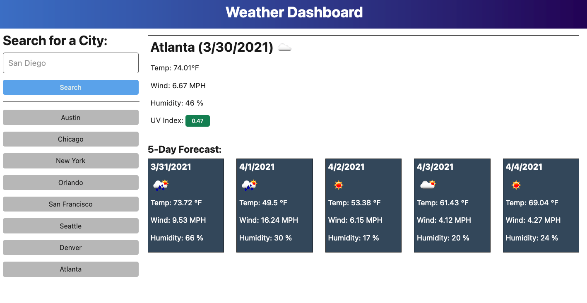

# Weather-Dashboard

## Description 
Weather-Dashboard is a dashboard that will run in the browser and feature dynamically updated HTML and CSS.
It uses the OpenWeather One Call API to retrieve weather data for cities across the nation.

### Technologies Utilized

*HTML
*CSS
*JavaScript/jQuery
*BootStrap

## Deployed Website

